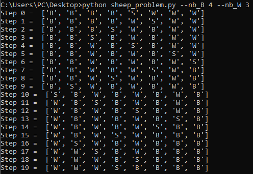

# Problem_of_black_and_white_sheeps
We are trying in this python script to solve the problem of black and white sheeps (Finding the optimal solution is not our goal).

<h1>Problem details :</h1>
<br>


<h1>Solution</h1>
This is my algorithm description :
L is the list of sheeps. Example L = ['B', 'B', 'B', 'B', 'S', 'W', 'W', 'W'].
"W"="White", "B"="Black", "S"="Empty Space", "C"="Color 'W' or 'B'", "Not_C"="the other color"

- Start by moving the white sheep "W" 

Repeat :

* If the index of the empty space in the list of sheeps is in {0,1,len(L)-1,len(L)-2} : 
  We have L = [S,...] or  [C,S,...] or [...,S,C] or [...,S]
  In this case, we treated all the possibilities separately following the same rules below.
* Else => We have 2 <= space_index <= len(List_of_sheeps)-2
- If ("C","S","C") => Jump "Not_C" if it is possible else move "C" 
- Else => We have ("C","S","Not_C") : move the sheep having the color same to the color in the memory (last operation) if it is possible
  
Until having the desired result ['W', 'W', 'W','S','B', 'B', 'B', 'B'].

<h1>Usage:</h1>
<br>

```shell
$python sheep_problem.py --nb_B number_of_black_sheeps --nb_W number_of_white_sheep
```

Example : 


```shell
$python sheep_problem.py --nb_B 4 --nb_W 3
```



<h1>Contact:</h1>

email : ghassene.tanabene@gmail.com

linkedin : https://www.linkedin.com/in/ghassene-tanabene/
