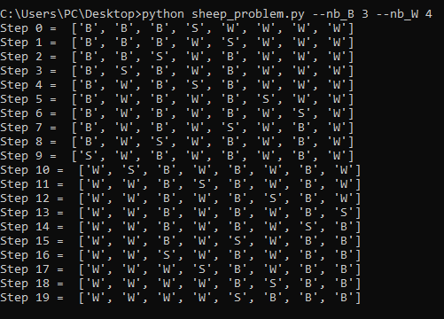

# Problem_of_black_and_white_sheeps
We are trying in this python script to solve the problem of black and white sheeps (Finding the optimal solution is not our goal).

<h1>Problem details :</h1>
<br>


<h1>Usage:</h1>
<br>

```shell
$python sheep_problem.py --nb_B number_of_black_sheeps --nb_W number_of_white_sheep
```

Example : 


```shell
$python sheep_problem.py --nb_B 4 --nb_W 3
```



<hr>
✉️ **Contact** : 

email : ghassene.tanabene@gmail.com

linkedin : https://www.linkedin.com/in/ghassene-tanabene/
